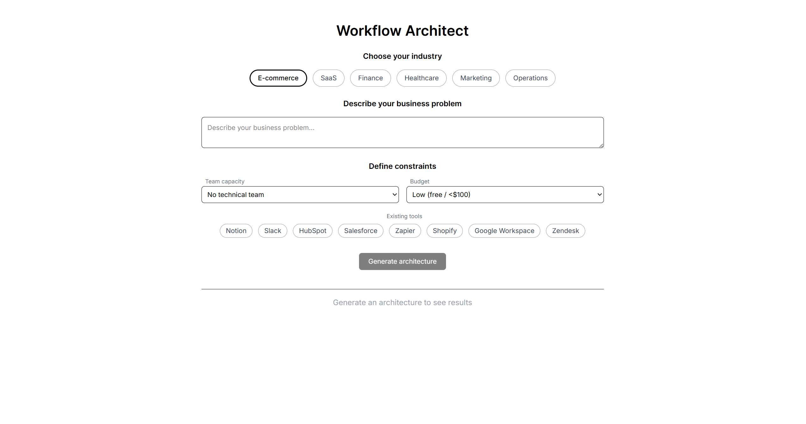
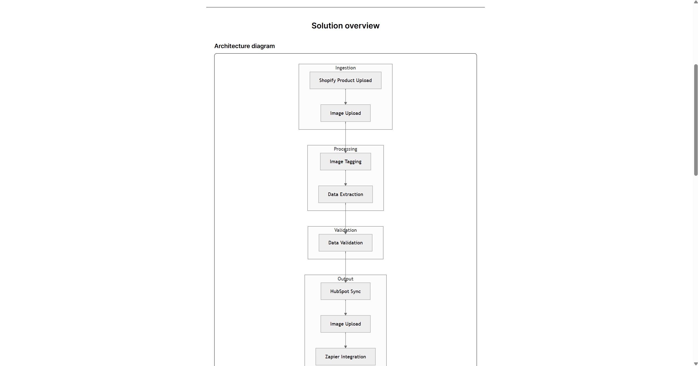
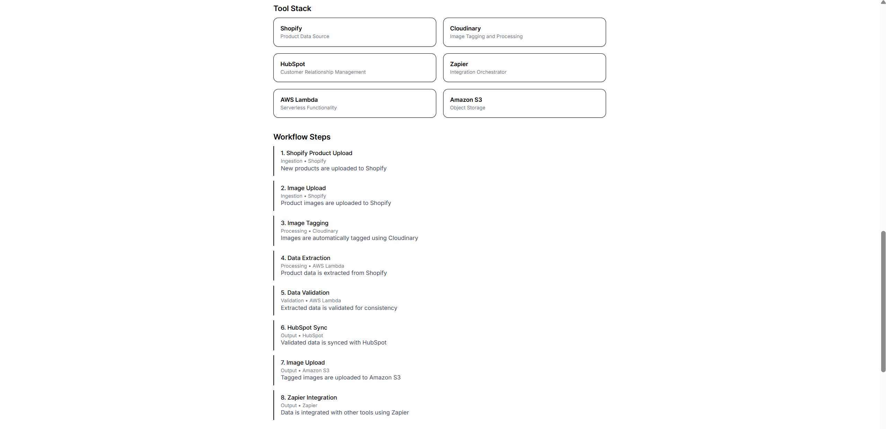
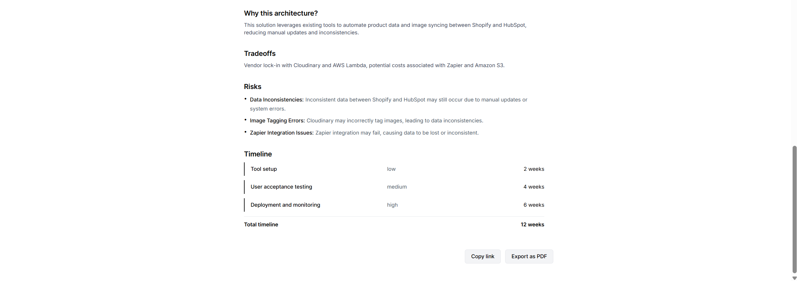

# Workflow Architect

### [🚀 View Live Demo Here](https://workflow-architect.vercel.app/)

## Overview

Workflow Architect translates business problems into production-ready integration architectures in under 60 seconds.

Given a business scenario and constraints, it generates:

- Recommended tool stack
- Step-by-step integration workflow
- Architecture diagram
- Implementation timeline

All outputs are formatted for direct client delivery.

### Constraint-aware generation

Recommendations adapt to team size, budget, and existing tech stack.
A no-code Zapier workflow for a non-technical team differs significantly from an enterprise-grade architecture
and the output reflects that.

### Stateless architecture

All state is Base64-encoded into the URL.
No database, authentication, or backend persistence required.
Generated solutions can be shared instantly via link.

### Structured LLM output

The API enforces a strict JSON schema with referential integrity between components.
Responses are validated server-side, with graceful fallbacks on failure.

### Mermaid diagram reliability

Prompt guardrails ensure valid diagrams:

- camelCase node IDs only
- No duplicate nodes
- Subgraphs reference pre-defined elements

This avoids common silent rendering failures in Mermaid.

### Print-ready export

PDF generation uses a dedicated print stylesheet (not canvas rendering), producing clean pagination and high-quality output without external dependencies.

## Stack

Next.js 14 (App Router) · Tailwind CSS · Groq SDK (Llama 3.3 70B) · Mermaid.js · Vercel

Prompt engineering and JSON schema design documented in `/prompts`.

## Test Scenarios

Includes 10 pre-built scenarios across:

- E-commerce
- SaaS
- Finance
- Healthcare
- Marketing
- Operations

These demonstrate how varying constraints (budget, team, stack) produce meaningfully different architectures.
